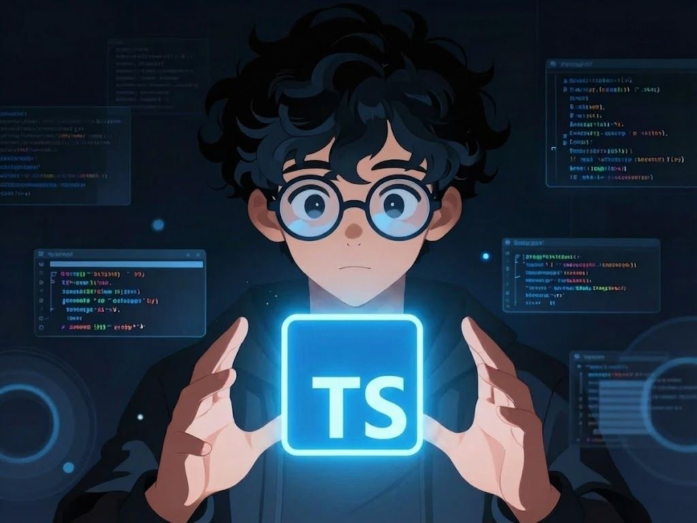

 

## 🛠️ Tech Stack

**Languages**

**Backend**

**Database & Infra**

**Tools & OS**

**Currently Learning**

---

## 🚀 Projetos

<table>
  <tr>
    <td align="center" width="50%">
      <h3>🏋️ MoonFit</h3>
      

        
      

      
Gerenciador de fichas de treino pensado como produto real — multi-tenant, com histórico de evolução e estrutura que cresce junto com o usuário.

      

        
        
        
        
        
        
        
      

    </td>
    <td align="center" width="50%">
      <h3>🌌 Nebula</h3>
      

        
      

      
CLI para scaffold de projetos com templates opinados — pule o boilerplate, comece pelo que importa.

      

        
        
        
        
        
        
      

    </td>
  </tr>
</table>

---

 

<picture>
  <source media="(prefers-color-scheme: dark)" srcset="https://raw.githubusercontent.com/By-Moonteiro/By-Moonteiro/output/github-snake-dark.svg" />
  <source media="(prefers-color-scheme: light)" srcset="https://raw.githubusercontent.com/By-Moonteiro/By-Moonteiro/output/github-snake.svg" />
  
</picture>

